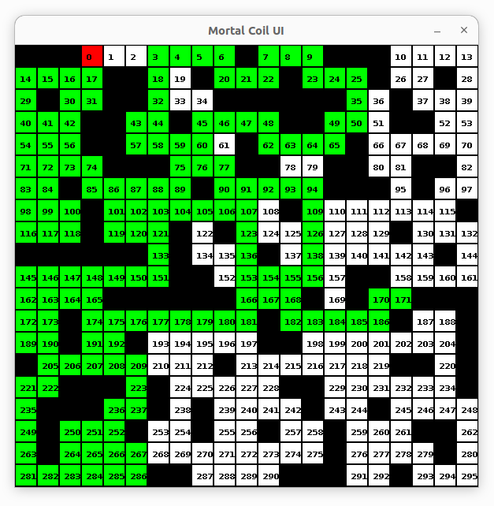

# mortal-coil-starter

Simple brute-force solver for [Mortal Coil puzzle](https://www.hacker.org/coil/index.php).

Written in Kotlin, provides a simple UI for showing the grid & debugging (see visited path).

